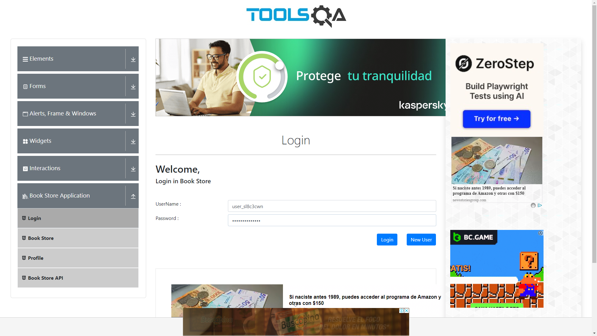
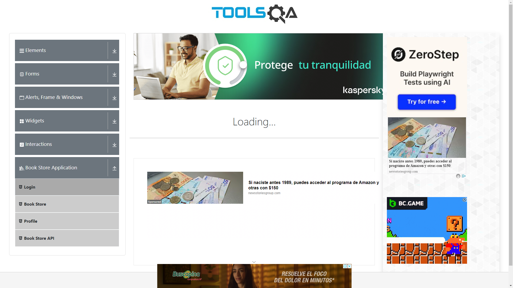
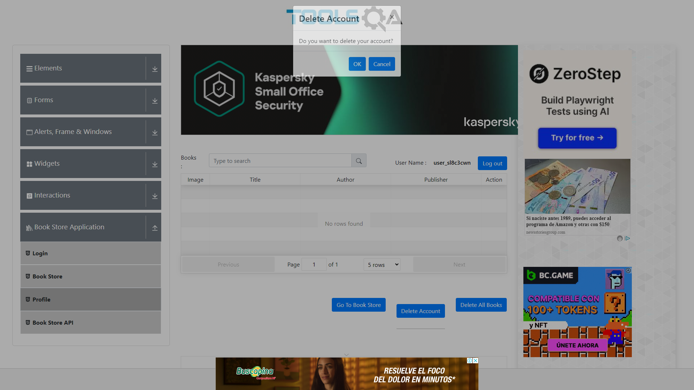
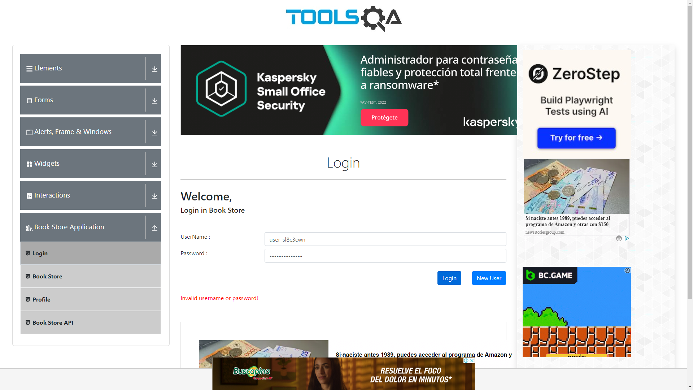

# taller-playwright-postman-api-testing

Este repositorio resuelve el taller de automatización de pruebas y test en APIs utilizando Playwright, para completar la actividad asignada en las sesión 5 del curso de Testing en EAFIT, el cual tiene dos retos

## Reto planteado 1 (Carpeta Challenge1 en el repositorio)

El propósito de este proyecto es utilizar las capacidades de Playwright para automatizar un flujo en donde previamente se han realizado request a un API para generar un usuario y realizar una prueba de Login, Delete de la cuenta y reintento de Login con las credenciales ya inválidas, luego de haberlas borrado. El reto es garantizar la ejecución del API antes de la ejecución de la prueba, utilizan los hooks disponibles para el ciclo de vida de la ejecución de las pruebas. Utilizamos en la prueba el sitio web [Demo QA](https://demoqa.com/login) y las definiciones su API en [Swagger](https://demoqa.com/swagger)

### Estructura del proyecto

- *Configuración de Playwright*:
  - [playwright.config.ts](playwright.config.ts)
- *Datos del equipo a conformar*:
  - [test.data.ts](data/test-data.ts) 
- *Tipado de la datos*:
  - [types/user-credentials.type.ts](types/user-credentials.type.ts)
- *Consumo de API, para la generación de la cuenta de usuario aleatoria*:
  - [api/create-user.request.ts](api/create-user.request.ts)
- *Páginas, en conformidad con el patrón POM*:
  - [pages/login.page.ts](pages/login.page.ts)
  - [pages/profile.page.ts](pages/profile.page.ts)
- *Especificación del caso de pruebas - Crear un equipo*:
  - [tests/create-user.spec.ts](tests/create-user.spec.ts)

### Orden de la ejecución del caso de prueba

Se realizaron los siguientes pasos en la especificación de la prueba:

I. En el *hook* `BeforeEach`, se ejecuta el llamado al API para generar el usuario.

Luego en el caso de prueba, se ejecuta:

1. Hacer uso de las credenciales de la cuenta aleatoria recién creada
2. _Tomar la evidencia en imagen_
3. Ingresar a la app con las credenciales generadas
4. _Tomar la evidencia en imagen_
5. Eliminar la cuenta y aceptar los *prompts* de validación en el DOM y como Alert
6. _Tomar la evidencia en imagen_
7. Reintentar el ingreso a la app con las credenciales de la cuenta recién borrada
8. **Realizar la aserción para verificar el mensaje de error presente por credenciales inválidas**
9. _Tomar la evidencia en imagen_

### Presentación de evidencias de ejecución exitosa

  

    
Uso de cuenta generada</b>

    
  

  

    
Login exitoso</b>

    
  

  

    
Borrado de cuenta</b>

    
  

  

    
Mensaje de error</b>

    
  

### Instalación y ejecución de la prueba

Para ejecutar el caso de prueba, realiza los siguientes pasos:
1. *Clona el proyecto*:
   `git clone <repo_url>`

2. *Ingresa a la carpeta del reto 1*:
   `cd /challenge1`

3. *Instala las dependencias*:
   `npm install`

4. *Ejecuta las pruebas*:
   `npx playwright test` (Opcional el flag `--ui`)

5. *Verifica los resultados*:
   En cada ejecución de las pruebas, el reporte se genera en el directorio `playwright-report/.` Al interior de este, el archivo `index.html` se puede abrir para ver un informe detallado de las pruebas.

   Cada ejecución regenera las imágenes de evidencia en la carpeta `./evidences`

## Reto planteado 2 (Carpeta Challenge2 en el repositorio)

Pendiente

## Requisitos

- Node.js (versión 16 o superior)

## Autores

Todo el trabajo fue realizado con prácticas de *pair programming*, aprovechando el plugin [Live Share de VSCode](https://visualstudio.microsoft.com/services/live-share/) y los *commits* del proyecto han sido realizados usando la coautores de Github.

- Andrés Ayala <amayalac@eafit.edu.co>
- Santiago Patiño <spatinob1@eafit.edu.co>

## Licencia

Este proyecto es un trabajo académico y está bajo la licencia MIT. Consulta el archivo [LICENSE](LICENSE) para más detalles.